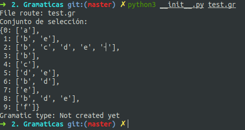

Universidad de Antioquia
==================
Laboratorio #2 ~ Teoria de Lenguajes
------------------

Integrantes:
- Leonardo Perez.
- Paula Gomez.

*Para ejecutar el proyecto, realizar lo siguiente*
---------------------------------------------------
1. Dar permisos de ejecucion: `chmod +x iniciar.sh`.
2. Ejecutar el archivo: `./instalar_dependencias.sh` o `sh instalar_dependencias.sh`, para ejecutar las dependencias. Esto solo lo realizaremos una vez.
3. Finalmente, para iniciar el proyecto, ejecutar: `./iniciar.sh` o `sh iniciar.sh`

Estado actual
--------------
